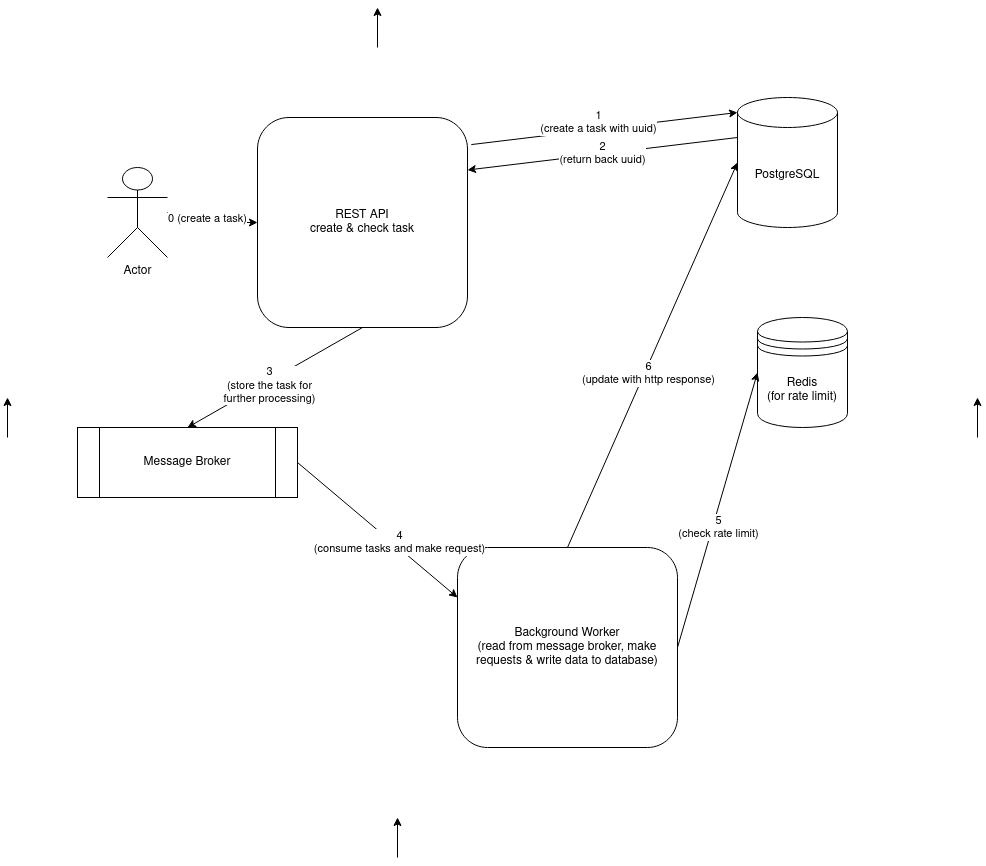

## REQUESTS MAKER

## Description
This microservice has been created to handle requests to 3rd party services

Enjoy it!

## To start

In order to start the microservice, you need to run external services with the following command:
```shell
make services_up
```
Start the microservice itself with the command:
```shell
make api_up
```
API will be accessible at the port :8600 by default

## The microservice is divided into four layers
* connections - consists of connection to PostgreSQL, Redis and Kafka
* provider - consists of methods for working with message broker, database and in-memory database. Note: it is abstracted from real instances
* service - responsible for business logic and business logic validation
* server - consists of background worker and REST API; parses http request data and sends it to service layer

## Tests

To run mock tests
```shell
make run_mock_tests
```

To run integration tests
```shell
make services_up
make run_interation_tests
```
Note: you need to run ```make services_up``` command first

### Solution:
* PostgreSQL - to store task info and http response after making requests
* Redis - will be used for rate limit
* Kafka - all the tasks sent via http requests will be first stored in kafka and background worker will handle the tasks

#### Requests

Create a task:
```shell
curl --location --request POST 'http://0.0.0.0:8600/api/v1/task' \
--header 'Content-Type: application/json' \
--data-raw '{
  "headers": {
    "Accept-Encoding": ["gzip, deflate, br"],
    "Accept-Language": ["en-US,en;q=0.5"],
    "Accept": ["text/html,application/xhtml+xml,application/xml;q=0.9,image/avif,image/webp,*/*;q=0.8"]
  },
  "method": "GET",
  "url": "https://google.com"
}' | jq
```

Check status of the task:

```shell
curl --location --request GET 'http://0.0.0.0:8600/api/v1/task/<task_id>' \
--header 'Content-Type: application/json; charset=utf-8' | jq
```

Check REST API docs [here](./docs/)

## General Design



## TODO
* add load test (check under highload)
* resolve TODOs left in the code
* metrics are not correct (it is just a PoC/proof of concept)
* create grafana graphics and make it runnable with docker command

